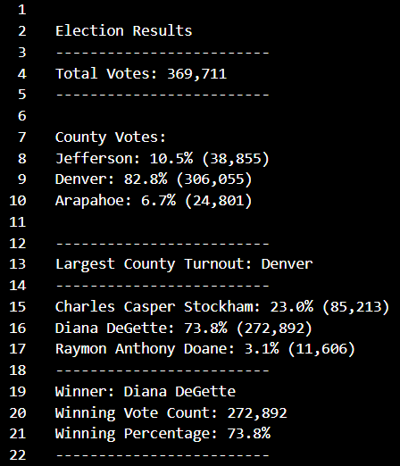

# Election Auditing with Python

## Project Overview

### An employee of the Colorado Board of Elections requested an audit of a recent local congressional election. The scope of the audit consisted of:

-   **Calculating the total number of votes cast**
-  **Compiling a list of counties from which votes were received**
-  **Calculating the total number of votes and percentage of votes cast in each county**
-  **Determining which county had the largest voter turnout** 
-  **Compiling a list of candidates who received votes**
-  **Calculating the total number of votes each candidate received**
-  **Calculating the percentage of votes won by each candidate**
-  **Determining the winner of the election based on popular vote**

## Resources 
- Data Source: election_results.csv
- Software: Python 3.7.6, Visual Studio Code 1.60.0

## Audit Results Summary

The analysis of the election results shows that:

- **There were 369,711 votes cast in this election.**
 
- The counties that voted in this election were:
	- Jefferson 
	- Denver
	- Arapahoe
 
- The county results were:
	- Jefferson County cast 10.5% of the vote with 38,855 votes
	- Denver County cast 82.8% of the vote with 306,055 votes
	- Arapahoe County cast 6.7% of the vote with 24,801 votes
 
- **The county with the largest voter turnout was Denver County with 306,055 votes, making up 82.8% of the total votes.**
- The candidates that received votes were:
	- Charles Casper Stockham
	- Diana DeGette
	- Raymon Anthony Doane
 
- The candidate results were:
	- Charles Casper Stockham received 23.0% of the vote with 85,213 votes.
	- Diana DeGette received 73.8% of the vote with 272,892 votes.
	- Raymon Anthony Doane received 3.1% of the vote with 11,606 votes.
 
- **The winner of the election was Diana DeGette with 272,892 votes, winning 73.8% of the popular vote.**

##Future Use of Audit Code
I propose using this script for future election audits as a means of quickly summarizing election results with several modifications as necessary. 

The script may need to be modified to specify the appropriate index that holds the needed information, depending on the structure of data source. In this current case, the csv file stored the county name in the second column (or index 1) and the candidate name in the third column (index 2). The index used in these variables (`county_name = row[1]` and `candidate_name = row[2]`) may need to be adjusted to match the appropriate index in future data files.

This script can also be modified to accommodate smaller scale elections by editing the variable names and output strings. For example, if this script is being used for a mayoral election, the variables related to counties could be renamed for districts within a city, granted the data file contained the district for each vote.   

